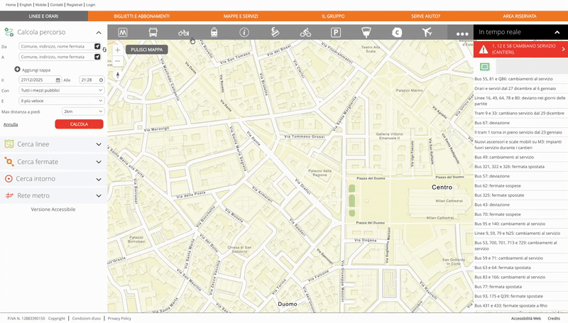

<p align="center">
  
</p>

# ATM Milano Realtime Stops

[](https://github.com/hacs/integration)
[](https://github.com/JanOstrowka/atm-milano/releases)
[](https://opensource.org/licenses/MIT)

A Home Assistant custom integration for real-time public transport arrival times from ATM Milano (Azienda Trasporti Milanesi).

## ⚠️ Legal Notice

**This integration is intended for personal, non-commercial use only.**

To comply with ATM Milano's terms of service, this HACS integration must not be used for commercial purposes. By using this integration, you agree to use it solely for personal home automation and not for any commercial application or redistribution.

## Features

- 🚌 Monitor real-time arrival times for trams, buses, metro, and trolleybuses in Milan
- 📍 One device per stop with sensors for each line
- 🔄 Smart state handling:
  - Numeric minutes when available (e.g., `2` with unit `min`)
  - Translated status messages: `arriving`, `updating`, `cancelled`
- 🎨 Dynamic icons based on transport type and status
- ⏱️ Configurable update interval (15-120 seconds)
- 📊 Rich attributes including GPS coordinates and timetable links

## Installation

### HACS (Recommended)

[](https://my.home-assistant.io/redirect/hacs_repository/?owner=JanOstrowka&repository=atm-milano&category=integration)

1. Click the button above, or manually add as a custom repository:
   - Open HACS in Home Assistant
   - Click the three dots menu → **Custom repositories**
   - Add `https://github.com/JanOstrowka/atm-milano` with category **Integration**
2. Search for "ATM Milano" and download
3. Restart Home Assistant

### Manual Installation

1. Download the `custom_components/atm_milano` folder from this repository
2. Copy it to your Home Assistant `config/custom_components/` directory
3. Restart Home Assistant

## Configuration

[](https://my.home-assistant.io/redirect/config_flow_start/?domain=atm_milano)

1. Click the button above, or go to **Settings** → **Devices & Services** → **Add Integration**
2. Search for "ATM Milano"
3. Enter:
   - **Stop ID**: The numeric stop ID (see below for how to find it)
   - **Update interval**: How often to fetch data (default: 60 seconds)

### How to Find Your Stop ID

You can find the stop ID in the ATM Milano app or on [giromilano.atm.it](https://giromilano.atm.it). Here's how (as shown in the GIF below):

1. Go to [giromilano.atm.it](https://giromilano.atm.it)
2. Click on **Surface Vehicle Stops** to show stops on the map
3. Find your desired stop on the map and click on it
4. View more details for a transport mode by clicking on it or the **>** icon
5. The stop ID appears after "Codice" (e.g., `Codice 11491`)



## Entities

Each stop creates a **Device** named after the stop (e.g., "Bausan").

For each line at the stop, a **Sensor** is created with:

| Attribute | Description |
|-----------|-------------|
| `state` | Minutes (integer) or status text (`arriving`, `updating`, `cancelled`) |
| `wait_text` | Original API message (e.g., "2 min", "in arrivo") |
| `wait_minutes` | Integer minutes, `0` for arriving, `None` for status messages |
| `status` | Normalized status: `minutes`, `arriving`, `updating`, `cancelled`, `unknown` |
| `line_code` | Line number (e.g., "2", "92") |
| `line_description` | Route description |
| `transport_type` | Vehicle type: `bus`, `tram`, `metro`, `trolleybus`, `radiobus` |
| `stop_latitude` | GPS latitude of the stop |
| `stop_longitude` | GPS longitude of the stop |
| `timetable_url` | Link to PDF timetable |

### State Values

| WaitMessage | State | Unit | wait_minutes | Icon (bus) |
|-------------|-------|------|--------------|------------|
| `"2 min"` | `2` | `min` | `2` | `mdi:bus` |
| `"in arrivo"` | `"arriving"` | - | `0` | `mdi:bus-stop` |
| `"ricalcolo"` | `"updating"` | - | `None` | `mdi:bus-clock` |
| `"Soppressa"` | `"cancelled"` | - | `None` | `mdi:bus-alert` |

### Transport Type Icons

| Type | Icon |
|------|------|
| Bus | `mdi:bus` (with status variants) |
| Tram | `mdi:tram` |
| Metro | `mdi:subway` |
| Trolleybus | `mdi:bus-electric` |
| Radiobus | `mdi:bus-school` |

## Example Automations

### Notify When Tram is Arriving Soon

```yaml
automation:
  - alias: "Tram 2 arriving soon"
    trigger:
      - platform: template
        value_template: >
          {{ state_attr('sensor.bausan_2_0', 'wait_minutes') is number
             and state_attr('sensor.bausan_2_0', 'wait_minutes') <= 4 }}
    action:
      - service: notify.notify
        data:
          title: "Tram Alert"
          message: >
            Tram 2: {{ states('sensor.bausan_2_0') }} 
            ({{ state_attr('sensor.bausan_2_0', 'wait_text') }})
```

### Notify When Line is Cancelled

```yaml
automation:
  - alias: "Line cancelled notification"
    trigger:
      - platform: state
        entity_id: sensor.bausan_2_0
        to: "cancelled"
    action:
      - service: notify.notify
        data:
          title: "Line Cancelled"
          message: "Tram 2 has been cancelled!"
```

### Dashboard Card with Wait Time

```yaml
type: entities
title: Fermata Bausan
entities:
  - entity: sensor.bausan_2_0
    name: Tram 2
  - entity: sensor.bausan_92_0
    name: Filobus 92
```

## Troubleshooting

### Connection Errors

- **Cannot connect**: Check your internet connection and that the ATM Milano API is accessible
- **Invalid stop**: Verify the stop ID exists by checking [giromilano.atm.it](https://giromilano.atm.it)

### Rate Limiting (429 Errors)

If you see 429 errors in the logs:

1. Increase the update interval in the integration settings
2. The API may be temporarily overloaded; wait and try again

### Entities Unavailable

- Check the Home Assistant logs for error details
- The line may have been removed from the stop temporarily
- Try reloading the integration

## API Information

This integration uses the ATM Milano GiroMilano API:

```
https://giromilano.atm.it/proxy.tpportal/api/tpPortal/geodata/pois/stops/{stop_id}
```

The API is public but unofficial. No API key is required.

## Contributing

Contributions are welcome! Please feel free to submit issues or pull requests.

## License

This project is licensed under the MIT License - see the [LICENSE](LICENSE) file for details.

## Disclaimer

This integration is not affiliated with or endorsed by ATM Milano. Use at your own risk.

